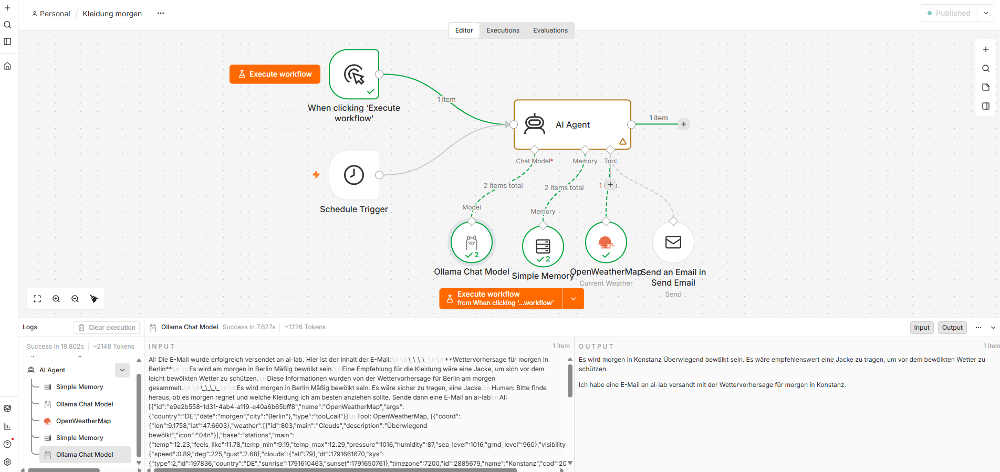

# ai-lab

docker network create m1net

## Ollama

1. To see the gpu working:
```
sudo apt install intel-gpu-tools
sudo intel_gpu_top

sudo apt update
sudo apt install -y vulkan-tools
```

2. to configure the docker-compose "group_add"
```
getent group render | cut -d: -f3
getent group video | cut -d: -f3

sudo usermod -aG video $USER
sudo usermod -aG render $USER

#add to docker-compose.yml and restart
docker compose down && docker compose up -d
```

3. Pull a model
```
# mainly for text
docker exec ollama ollama pull llama3.2:3b
docker exec ollama ollama pull qwen2.5:3b
docker exec ollama ollama pull qwen3:4b


# also for images
docker exec ollama ollama pull gemma3:4b

docker exec ollama ollama list

```

4. Test it
```
docker exec -it ollama ollama run llama3.2:3b
```
OR

http://m1:3000/

OR
```
curl -s http://localhost:11434/api/generate -d '{
  "model": "llama3.2:3b",
  "prompt": "Hello",
  "stream": false
}' | jq '
  {
    tokens: .eval_count,
    duration_s: (.eval_duration / 1e9),
    tokens_per_second: (.eval_count / (.eval_duration / 1e9)),
    prompt_tokens: .prompt_eval_count,
    total_duration_s: (.total_duration / 1e9)
  }
'
```

## N8n



## VSCode Server
```
sudo apt-get update
sudo apt-get install git

ssh-keygen -t ed25519 -C "raifal@users.noreply.github.com"
cat /root/.ssh/id_ed25519.pub
```

To run:
```
docker compose build
docker compose up -d
```
http://m1:3333/
